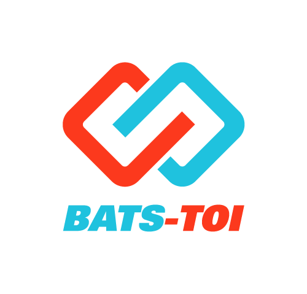

# digiYo

  

  <b>Welcome to Batstoi's digiYo repository!</b>
  

  
## What is digiYo?

digiYo is [Batstoi’s](https://batstoi.com/) nonfungible token game developed with flow cadence featuring various martial arts through 3D animations created using motion capture technology. 

Our video game provides an interactive and engaging experience for you to make the most out of digiYo. We support in-game buying of card packs, inter-user trading, and more through the [Blocto](https://blocto.portto.io/en/) app.

## What is this repository?
This github repository was made to record our work on a public interface to both receive and offer feedback from the rest of the [flow](https://www.onflow.org/) community! This dev doc includes Cadence files for our digiYo minting based on blockchain and transactions and Node JS files for our webapp. 

## Requirements for following through 
If you wish to run this repository, you will need to [install Flow Command Line (FCL)](https://docs.onflow.org/flow-cli/install). 

## Webapp Design

Creating a webapp utilizing blockchain from scratch may be daunting and confusing. This legend (with a bunch of cool dropdowns) may help you understand the format better!

<!DOCTYPE html>

    
app

    <ul>
        <li>api folder</li>
    </ul>
    <ul style="list-style-type:none;">
        <li>

        
<b>cadence</b>

          This is where we put the contracts, scripts, and transactions
          where we put the contracts, scripts, transactions
        
</li>
        <li>

        
<b>web</b>

            <ul style="list-style-type:none;">
                <li>

                    
<b>public</b>

                    The root folder that gets dealt by the web server in the end; contains a significant file, index.html
                    <ul style="list-style-type:none;">
                    <li>

                        
index.html

                        THE single html page in our project containing the ID root on line 18, where we place our React application.
                    

                    <li>

                        
manifest.json

                        Gives information to the broswer about your application. For example, this is required for mobile browsers so that you can add a shortcut to your web application.
                        

                    </ul>
                    

                </li>
                <li>

                    
<b>src</b>

                    <ul style="list-style-type:none;">
                        <li>

                            
parts folder

                            Contains general components that use one or more Hooks and one or more display components.
                        

                        <li>

                            
<b>svg</b>

                            Contains images of NFTs and logos.
                            <ul style = "list-style-type:none;">
                                <li>
                                    

                                        
<b>items</b>

                                        Contains images of NFTs
                                    

                              </li>
                            </ul>
                            

                        <li>

                            
<b>util</b>

                            Contains small single-purpose funcitons, without dependencies, free of side effects, and format values (to print and view in UI). 
                            <ul style = "list-style-type:none;">
                                <li>

                                    
fetcher.js

                                <ul>
                                    <li>a function that returns the data (formatted in json) from a url</li>
                                    <li>Will be imported and called in use_market_items.hook.js to fetch data in line 22 in funciton useSWR()</li>
                                </ul>
                            
</li>
                            <li>

                                
fmt-flow.js

                                <ul>
                                    <li>a function for displaying flow balance (as a string)</li>
                                    <li>imported and called in flow-balance-cluster.comp.js to show flow balance in a label on line 16.</li>
                                </ul>
                            
</li>
                            <li>

                                
fmt-kibble.js

                                <ul>
                                    <li>a function for displaying coin (digiyo currency) balance as a cleaned up string.</li>
                                    <li>imported and called in balance-cluster.comp.js to show coin balance in table data in line 45 and also in kibbles-balance-cluster.comp.js to show coin balance in label in line 18.</li>
                                </ul>
                            
</li>
                            <li>

                                
normalize-item.js

                                <ul>
                                    <li>a function that (given an item (json data fetched from useSWR) as parameter) returns an object assoicated with metadata, item id, type id, owner, price, and transaction id.</li>
                                    <li>Where it is called: after fetching data using useSWR in use-market-items.hook.js, if successful, it will take a list given by some parent component, loop through all the items fetched previously, make them into objects with metadata, then set the parent's list as a list of objects with those formatted data. See line 29.</li>
                                </ul>
                            
</li>
                            <li>

                                
sleep.js

                                <ul>
                                    <li>a function to make the code wait (default wait time = 500 miliseconds) before executing the next line of code.</li>
                                    <li>since Javascript is asynchronous, this means you can't pause/block code execution, so you must use this funciton to make things wait </li>
                                    <li>use in use-initialized.hook.js where it returns a function that maintains variables about whether the account is initialized, its status, flow and kibble (coiin) balance. It updates by calling the initializeAccount function (status PROCESSSING). If successful, it refreshes the flow kibble balance and sets SUCCESS status. When initialization and update process is complete, it calls the SLEEP (delay time) to wait and then reset the status back ot IDLE. See line 73.</li>
                                </ul>
                            
</li>
                            </ul>
                        
</li>
                        <li>index.js</li>
                        <li>

font.css and theme.js

                        Files for installed UI theme and font
</li>
                    </ul>
                
</li>
                <li>
                    

                        
.env.example

                        Contains environment variables.
                    

                </li>
                <li>
                    

                        
package.json and package-lock.json

                        Json file to install dependencies; automatically created with <code>create-react-app</code>.
                    

                </li>
            </ul>
        
</li>
        <li>
            

                
app.json

                Contains information about the flow account such as the address and private key. 
            

        </li>
        <li>
            

                
flow.json

                Where you can update/add/delete the names and file locations of the contracts as they are created and specifiy which network the contracts are deployed to.
            

            </li>
            <li>
            

                
.env

                Stores FLOW_ADDRESS and FLOW_PRIVATE_KEY. 
            

            </li>
            <li>
                

                    
.gitignore

                    Contains information that you do not want to commit to git, such as the .env file. 
                

                </li>

    </ul>

